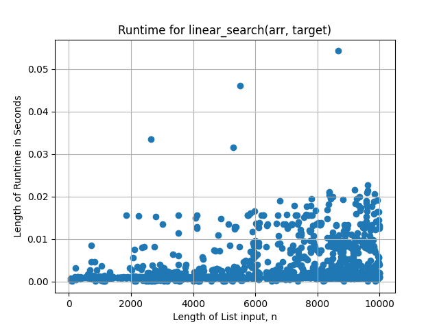
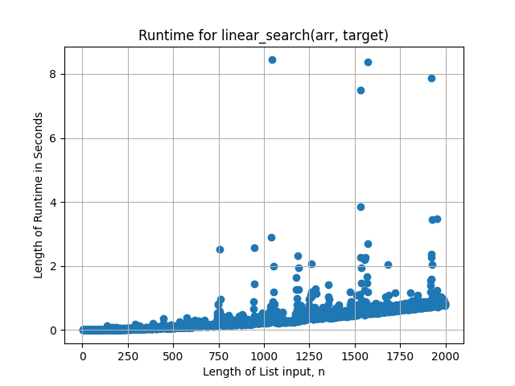

# W9D1-tp-s24-BigOofN

## w9d1.py

This file contains the functions linear_search(arr, target) and bubble_sort(arr).

### linear_search(arr, target)

This function takes two arguments. The first is a list, and the second an integer. This function searches arr for target. This function runs in O(n) time.

There are some test cases to show how this function works. Each test case is successful.

### bubble_sort(arr)

This function takes one argument: a list. This function sorts the elements of arr using the bubble sort method. This function runs in O(n^2) time.

There are some test cases to show how this function works. Each test case is successful.

# Analysis of Both Functions

Included in this repository are two files. Each file performs time trials on one function. Each analysis results in a graph that represents the timing of each function dependent on the input size.

## trial.py

This file tests the runtime for linear_search(arr, target). For every n, where 1 \< n \< 10000, a list of length n is randomly generated. A target is also randomly generated. The function is called 10000 times, one per each value of n. The function is timed using time.time(). The data is recorded as pairs (n, time) (it should be noted that only runtimes that were none-zero were recorded so as to obtain a better idea of the upper bound). Using matplotlib, a graph is produced that shows the runtime for input size n.

Although not readily clear, this function runs in linear time. The linearity is not apparent because linear_search(arr, target) does not necessarily need to traverse the full list before obtaining the target. The data that are seen at the very top of the scatter plot are representative of how long it would take if the function were to traverse all of, or nearly all of, arr. These points can be bounded by a linear function f(x) = cn, where c is some Real Number constant.

## trial2.py

This file tests the runtime for bubble_sort(arr). For every n, where 1 \< n \< 2000, a list of length n is randomly generated. The function is called 2000 times, one per each value of n. The function is timed using time.time(). The data is recorded as pairs (n, time). Using matplotlib, a graph is produced that shows the runtime for input size n.

This function runs in quadratic time. These points are bounded by a quadratic function f(x) = cx^2, where c is some Real Number constant.
